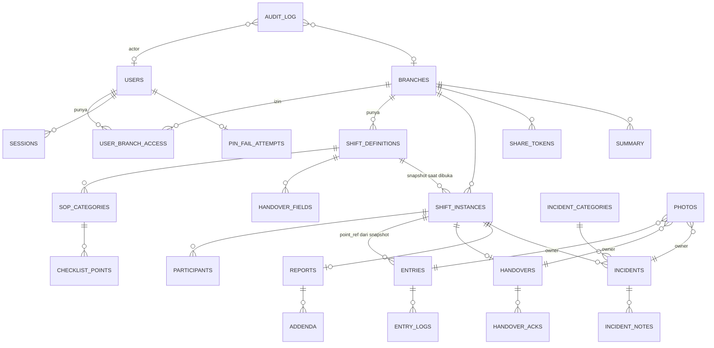

# Database Schema (PostgreSQL/Supabase) — checklist-shift v2

Acuan: `PRD.md` (bagian 10) dan `TRD.md` (bagian 6–8). Dokumen ini adalah kontrak antara kode `apps/web` dan isi database. Skema Zod di `packages/shared` harus identik dengan dokumen ini.

> **Perubahan dari v1:** Database berganti dari Google Sheets ke **Supabase PostgreSQL dengan Drizzle ORM**. Redis, rowmap cache, tab bulanan, rekonsiliasi Sheets, kompresi snapshot — semua dihapus.

---

## 1. Prinsip

1. **Satu database PostgreSQL** untuk semua data. Cabang dibedakan via kolom `branch_id`.
2. **SQL enforces constraints** — unique constraint, FK, CHECK. Tidak perlu aplikasi-level workaround seperti di Sheets.
3. **Tidak ada hapus baris** (BR-40). Data dinonaktifkan/di-void/diarsip.
4. **ID: ULID** (26 karakter, TEXT), dibuat di aplikasi dengan library `ulid`.
5. **Waktu: TIMESTAMPTZ** (UTC). Ditampilkan sesuai timezone cabang di frontend.
6. **Lock: advisory lock PostgreSQL** untuk BR-01 dan tutup shift; `SELECT FOR UPDATE` untuk BR-12.
7. **Idempotency aksi checklist**: kolom UNIQUE `client_action_id` di `entry_logs` (pengganti Redis idem key).
8. **Semua cache dapat dibangun ulang dari DB.** Tidak ada state tersembunyi di Redis.

---

## 2. Konvensi

### 2.1 Tipe Kolom

| Tipe | PostgreSQL | Catatan |
|---|---|---|
| `id` | TEXT (ULID 26 char) | Selalu kolom pertama |
| `string` | TEXT | Teks biasa |
| `text` | TEXT | Teks panjang |
| `int` | INTEGER | |
| `bigint` | BIGINT | Untuk sequence |
| `float` | FLOAT | |
| `bool` | BOOLEAN | |
| `datetime` | TIMESTAMPTZ | UTC, disimpan dan diambil UTC |
| `date` | DATE | Tanggal zona cabang (BR-02) |
| `time` | TEXT | Format `HH:mm`, jam dinding zona cabang |
| `json` | JSONB | Native PostgreSQL, tidak perlu kompresi |
| `enum` | TEXT + CHECK | Divalidasi juga di Zod |
| `hash` | TEXT | Hex SHA-256 (64 karakter) |
| `X?` | ... | Nullable kolom |

### 2.2 Kolom Standar

Setiap tabel memiliki: `created_at TIMESTAMPTZ NOT NULL DEFAULT NOW()`. Tabel yang bisa diedit memiliki `updated_at TIMESTAMPTZ NOT NULL DEFAULT NOW()`. Tabel dengan edit in-place memiliki `version INTEGER NOT NULL DEFAULT 1` (optimistic locking, naik 1 setiap UPDATE).

---

## 3. Diagram Relasi



---

## 4. Tabel Global

### 4.1 `branches`

```sql
CREATE TABLE branches (
  id          TEXT PRIMARY KEY,
  name        TEXT NOT NULL,
  code        TEXT UNIQUE NOT NULL,  -- misal 'BDG01', huruf besar tanpa spasi
  address     TEXT,
  timezone    TEXT NOT NULL DEFAULT 'Asia/Jakarta',  -- IANA timezone
  is_active   BOOLEAN NOT NULL DEFAULT TRUE,
  created_at  TIMESTAMPTZ NOT NULL DEFAULT NOW(),
  updated_at  TIMESTAMPTZ NOT NULL DEFAULT NOW()
);
```

### 4.2 `users`

```sql
CREATE TABLE users (
  id              TEXT PRIMARY KEY,
  name            TEXT NOT NULL,
  username        TEXT UNIQUE NOT NULL,  -- lowercase, tanpa spasi
  pin_hash        TEXT NOT NULL,         -- argon2 + PIN_PEPPER. JANGAN log.
  role            TEXT NOT NULL CHECK (role IN ('admin', 'petugas')),
  is_active       BOOLEAN NOT NULL DEFAULT TRUE,
  must_change_pin BOOLEAN NOT NULL DEFAULT TRUE,  -- TRUE untuk PIN awal/reset
  locked_until    TIMESTAMPTZ,
  last_login_at   TIMESTAMPTZ,
  pin_changed_at  TIMESTAMPTZ,
  created_at      TIMESTAMPTZ NOT NULL DEFAULT NOW(),
  updated_at      TIMESTAMPTZ NOT NULL DEFAULT NOW(),
  version         INTEGER NOT NULL DEFAULT 1
);
```

### 4.3 `user_branch_access`

```sql
CREATE TABLE user_branch_access (
  id          TEXT PRIMARY KEY,
  user_id     TEXT NOT NULL REFERENCES users(id),
  branch_id   TEXT NOT NULL REFERENCES branches(id),
  granted_by  TEXT NOT NULL REFERENCES users(id),
  is_active   BOOLEAN NOT NULL DEFAULT TRUE,
  created_at  TIMESTAMPTZ NOT NULL DEFAULT NOW(),
  updated_at  TIMESTAMPTZ NOT NULL DEFAULT NOW(),
  UNIQUE(user_id, branch_id)
);
-- Pencabutan = set is_active=FALSE, bukan hapus baris (BR-40)
-- Pemberian ulang = UPDATE is_active=TRUE pada baris yang sama
```

### 4.4 `incident_categories`

```sql
CREATE TABLE incident_categories (
  id          TEXT PRIMARY KEY,
  name        TEXT UNIQUE NOT NULL,
  sort_order  INTEGER NOT NULL DEFAULT 0,
  is_active   BOOLEAN NOT NULL DEFAULT TRUE,
  created_at  TIMESTAMPTZ NOT NULL DEFAULT NOW(),
  updated_at  TIMESTAMPTZ NOT NULL DEFAULT NOW()
);
```

### 4.5 `settings`

```sql
CREATE TABLE settings (
  key         TEXT PRIMARY KEY,
  value       TEXT NOT NULL,
  value_type  TEXT NOT NULL CHECK (value_type IN ('int', 'bool', 'string', 'text')),
  updated_by  TEXT REFERENCES users(id),
  updated_at  TIMESTAMPTZ NOT NULL DEFAULT NOW()
);
```

**Default values (di-seed saat setup):**

| key | default | value_type | Sumber |
|---|---|---|---|
| `tolerance_default_minutes` | `15` | int | PRD 7.11 |
| `pin_max_attempts` | `5` | int | PRD 7.11 |
| `pin_lock_minutes` | `15` | int | PRD 7.11 |
| `session_days` | `30` | int | PRD 7.11 |
| `share_token_days` | `30` | int | PRD 7.11 |
| `incident_link_window_hours` | `4` | int | PRD 7.11 |
| `photo_max_count` | `5` | int | PRD 7.11 |
| `photo_max_size_kb` | `150` | int | Target WebP |
| `photo_retention_days` | `0` | int | 0 = tanpa batas (arsip cron handle) |
| `public_show_photos` | `TRUE` | bool | Default tampil |
| `pin_block_weak` | `TRUE` | bool | Tolak 123456, 000000, dll |
| `whatsapp_template` | `{cabang} {tanggal} {shift} {pj} {ringkasan} {tautan}` | text | PRD 7.11 |

### 4.6 `sessions`

```sql
CREATE TABLE sessions (
  id          TEXT PRIMARY KEY,   -- = sessionId di JWT payload
  user_id     TEXT NOT NULL REFERENCES users(id),
  device_info TEXT,
  created_at  TIMESTAMPTZ NOT NULL DEFAULT NOW(),
  expires_at  TIMESTAMPTZ NOT NULL,
  revoked_at  TIMESTAMPTZ         -- NULL = aktif
);

CREATE INDEX idx_sessions_user_active ON sessions(user_id)
  WHERE revoked_at IS NULL;
```

Pencabutan sesi: `UPDATE sessions SET revoked_at = NOW() WHERE id = $1`.
Logout semua: `UPDATE sessions SET revoked_at = NOW() WHERE user_id = $1 AND revoked_at IS NULL`.

### 4.7 `share_tokens`

```sql
CREATE TABLE share_tokens (
  id                TEXT PRIMARY KEY,     -- bagian publik, ada di URL
  secret_hash       TEXT NOT NULL,        -- SHA-256(secret), secret = 32 byte random base64url
  branch_id         TEXT NOT NULL REFERENCES branches(id),
  report_id         TEXT NOT NULL,
  shift_instance_id TEXT NOT NULL,
  expires_at        TIMESTAMPTZ NOT NULL,
  revoked_at        TIMESTAMPTZ,
  revoked_by        TEXT REFERENCES users(id),
  created_by        TEXT NOT NULL REFERENCES users(id),
  created_at        TIMESTAMPTZ NOT NULL DEFAULT NOW()
);
-- Format token di URL: /r/{id}.{secret}
-- Lookup: SELECT by id → compare SHA-256(secret) dengan secret_hash
```

### 4.8 `push_subscriptions`

```sql
CREATE TABLE push_subscriptions (
  id          TEXT PRIMARY KEY,
  user_id     TEXT NOT NULL REFERENCES users(id),
  endpoint    TEXT UNIQUE NOT NULL,
  p256dh      TEXT NOT NULL,
  auth        TEXT NOT NULL,
  device_info TEXT,
  revoked_at  TIMESTAMPTZ,
  created_at  TIMESTAMPTZ NOT NULL DEFAULT NOW()
);
```

### 4.9 `notification_prefs`

```sql
CREATE TABLE notification_prefs (
  id         TEXT PRIMARY KEY,
  user_id    TEXT NOT NULL REFERENCES users(id),
  type       TEXT NOT NULL,
  enabled    BOOLEAN NOT NULL DEFAULT TRUE,
  updated_at TIMESTAMPTZ NOT NULL DEFAULT NOW(),
  UNIQUE(user_id, type)
);
-- Tidak ada baris = default aktif (enabled = TRUE)
```

### 4.10 `notifications`

```sql
CREATE TABLE notifications (
  id          TEXT PRIMARY KEY,
  user_id     TEXT NOT NULL REFERENCES users(id),
  type        TEXT NOT NULL,  -- 'handover_baru', 'pengingat_item', 'ganti_pj', 'tutup_paksa', 'shift_tidak_ditutup', 'shift_tidak_dibuka', 'incident_baru', 'shift_ditutup', 'aksi_darurat'
  payload     JSONB NOT NULL,  -- data relevan (shift_id, item_id, dll)
  read_at     TIMESTAMPTZ,     -- NULL = belum dibaca
  created_at  TIMESTAMPTZ NOT NULL DEFAULT NOW()
);
CREATE INDEX idx_notifications_user ON notifications(user_id, created_at DESC);
CREATE INDEX idx_notifications_unread ON notifications(user_id) WHERE read_at IS NULL;
```

### 4.11 `pin_fail_attempts`

```sql
CREATE TABLE pin_fail_attempts (
  user_id        TEXT PRIMARY KEY REFERENCES users(id),
  count          INTEGER NOT NULL DEFAULT 0,
  last_attempt_at TIMESTAMPTZ NOT NULL DEFAULT NOW()
);
-- Pengganti Redis 'pinfail:{userId}'
-- Reset (DELETE atau count=0) saat login berhasil
-- Jika count >= pin_max_attempts → set users.locked_until
```

### 4.12 `audit_log`

```sql
CREATE TABLE audit_log (
  id                TEXT PRIMARY KEY,
  seq               BIGSERIAL,          -- nomor urut global (untuk hash chain per scope)
  at                TIMESTAMPTZ NOT NULL DEFAULT NOW(),
  actor_id          TEXT REFERENCES users(id),
  action            TEXT NOT NULL,      -- 'shift.buka', 'shift.tutup_paksa', 'akun.reset_pin', dll
  object_type       TEXT,               -- 'ShiftInstance', 'User', 'Report', dll
  object_id         TEXT,
  branch_id         TEXT REFERENCES branches(id),
  shift_instance_id TEXT,
  before            JSONB,              -- JANGAN memuat pin_hash
  after             JSONB,
  reason            TEXT,               -- wajib untuk aksi sensitif
  prev_hash         TEXT NOT NULL,      -- hash baris audit sebelumnya (64 nol untuk baris pertama)
  hash              TEXT NOT NULL       -- SHA-256(prev_hash || '|' || canonicalJSON({seq,at,actor_id,...}))
);

CREATE INDEX idx_audit_log_branch ON audit_log(branch_id, at DESC);
CREATE INDEX idx_audit_log_actor ON audit_log(actor_id, at DESC);
```

**Hash chain:** verifikasi mingguan oleh cron. Jika `hash` tidak cocok dengan rekalkulasi → notifikasi admin `aksi_darurat`. Bersifat deteksi, bukan pencegahan.

---

## 5. Tabel Template Cabang

### 5.1 `shift_definitions`

```sql
CREATE TABLE shift_definitions (
  id               TEXT PRIMARY KEY,
  branch_id        TEXT NOT NULL REFERENCES branches(id),
  name             TEXT NOT NULL,
  start_time       TEXT NOT NULL,  -- 'HH:mm'
  end_time         TEXT NOT NULL,  -- 'HH:mm'
  crosses_midnight BOOLEAN NOT NULL DEFAULT FALSE,
  sort_order       INTEGER NOT NULL DEFAULT 0,
  is_active        BOOLEAN NOT NULL DEFAULT TRUE,
  created_at       TIMESTAMPTZ NOT NULL DEFAULT NOW(),
  updated_at       TIMESTAMPTZ NOT NULL DEFAULT NOW(),
  version          INTEGER NOT NULL DEFAULT 1
);
CREATE INDEX idx_shift_definitions_branch ON shift_definitions(branch_id);
```

### 5.2 `sop_categories`

```sql
CREATE TABLE sop_categories (
  id                  TEXT PRIMARY KEY,
  shift_definition_id TEXT NOT NULL REFERENCES shift_definitions(id),
  name                TEXT NOT NULL,
  sort_order          INTEGER NOT NULL DEFAULT 0,
  is_active           BOOLEAN NOT NULL DEFAULT TRUE,
  created_at          TIMESTAMPTZ NOT NULL DEFAULT NOW(),
  updated_at          TIMESTAMPTZ NOT NULL DEFAULT NOW(),
  version             INTEGER NOT NULL DEFAULT 1
);
CREATE INDEX idx_sop_categories_shift ON sop_categories(shift_definition_id);
```

### 5.3 `checklist_points`

```sql
CREATE TABLE checklist_points (
  id                TEXT PRIMARY KEY,
  sop_category_id   TEXT NOT NULL REFERENCES sop_categories(id),
  title             TEXT NOT NULL,
  instruction       TEXT,
  input_type        TEXT NOT NULL CHECK (input_type IN ('centang','foto','teks','angka','ok_tidak_ok')),
  is_required       BOOLEAN NOT NULL DEFAULT TRUE,
  target_time       TEXT,          -- 'HH:mm', null = tanpa waktu target
  tolerance_minutes INTEGER,       -- null = pakai tolerance_default_minutes dari settings
  active_days       TEXT,          -- '1,3,5' (1=Senin...7=Minggu), null = setiap hari
  number_min        FLOAT,         -- hanya untuk input_type='angka'
  number_max        FLOAT,
  sort_order        INTEGER NOT NULL DEFAULT 0,
  is_active         BOOLEAN NOT NULL DEFAULT TRUE,
  created_at        TIMESTAMPTZ NOT NULL DEFAULT NOW(),
  updated_at        TIMESTAMPTZ NOT NULL DEFAULT NOW(),
  version           INTEGER NOT NULL DEFAULT 1
);
CREATE INDEX idx_checklist_points_category ON checklist_points(sop_category_id);
```

### 5.4 `handover_fields`

```sql
CREATE TABLE handover_fields (
  id                  TEXT PRIMARY KEY,
  shift_definition_id TEXT NOT NULL REFERENCES shift_definitions(id),
  label               TEXT NOT NULL,
  field_type          TEXT NOT NULL CHECK (field_type IN ('teks','angka','pilihan','ya_tidak')),
  options             JSONB,        -- array string untuk tipe 'pilihan'
  is_required         BOOLEAN NOT NULL DEFAULT FALSE,
  sort_order          INTEGER NOT NULL DEFAULT 0,
  is_active           BOOLEAN NOT NULL DEFAULT TRUE,
  created_at          TIMESTAMPTZ NOT NULL DEFAULT NOW(),
  updated_at          TIMESTAMPTZ NOT NULL DEFAULT NOW(),
  version             INTEGER NOT NULL DEFAULT 1
);
CREATE INDEX idx_handover_fields_shift ON handover_fields(shift_definition_id);
```

---

## 6. Tabel Operasional

### 6.1 `shift_instances` (Induk Operasional)

```sql
CREATE TABLE shift_instances (
  id                    TEXT PRIMARY KEY,
  branch_id             TEXT NOT NULL REFERENCES branches(id),
  shift_definition_id   TEXT NOT NULL REFERENCES shift_definitions(id),
  shift_date            DATE NOT NULL,      -- tanggal dibuka, zona cabang (BR-02)
  status                TEXT NOT NULL DEFAULT 'berjalan'
                          CHECK (status IN ('berjalan','ditutup','ditutup_paksa','void')),
  pj_user_id            TEXT NOT NULL REFERENCES users(id),
  opened_by             TEXT NOT NULL REFERENCES users(id),  -- sama dg pj kecuali "buka atas nama"
  opened_at             TIMESTAMPTZ NOT NULL,
  opened_outside_hours  BOOLEAN NOT NULL DEFAULT FALSE,      -- BR-04
  closed_at             TIMESTAMPTZ,
  closed_by             TEXT REFERENCES users(id),
  close_type            TEXT CHECK (close_type IN ('normal','paksa')),
  force_close_reason    TEXT,               -- wajib bila paksa
  is_incomplete         BOOLEAN NOT NULL DEFAULT FALSE,      -- BR-34
  no_incident_confirmed BOOLEAN NOT NULL DEFAULT FALSE,      -- BR-33
  void_reason           TEXT,
  void_by               TEXT REFERENCES users(id),
  void_at               TIMESTAMPTZ,
  is_test               BOOLEAN NOT NULL DEFAULT FALSE,      -- mode pratinjau
  template_snapshot     JSONB NOT NULL,     -- snapshot template saat dibuka (BR-05)
  snapshot_hash         TEXT NOT NULL,      -- SHA-256 dari snapshot kanonik
  created_at            TIMESTAMPTZ NOT NULL DEFAULT NOW(),
  updated_at            TIMESTAMPTZ NOT NULL DEFAULT NOW(),
  version               INTEGER NOT NULL DEFAULT 1
);

-- BR-01: satu shift non-void per (shift_definition_id, shift_date, is_test)
CREATE UNIQUE INDEX uix_shift_br01
  ON shift_instances(shift_definition_id, shift_date, is_test)
  WHERE status != 'void';

CREATE INDEX idx_shift_instances_branch_date ON shift_instances(branch_id, shift_date DESC);
CREATE INDEX idx_shift_instances_status ON shift_instances(status) WHERE status = 'berjalan';
```

**Format `template_snapshot` (JSONB):**
```json
{
  "v": 1,
  "shift": {"id": "...", "name": "Opening", "start_time": "07:00", "end_time": "15:00", "crosses_midnight": false},
  "settings": {"tolerance_default_minutes": 15, "timezone": "Asia/Jakarta"},
  "categories": [
    {"id": "...", "name": "Kebersihan", "sort_order": 1,
     "points": [
       {"point_ref": "<checklist_points.id>", "title": "...", "input_type": "angka",
        "is_required": true, "target_time": "07:30", "tolerance_minutes": 15,
        "active_days": "1,2,3,4,5", "number_min": 1.0, "number_max": 5.0, "sort_order": 1}
     ]}
  ],
  "handover_fields": [
    {"id": "...", "label": "Kas awal", "field_type": "angka", "options": null, "is_required": true, "sort_order": 1}
  ]
}
```

Butir yang tidak berlaku pada hari itu (`active_days`) **tidak masuk** snapshot. Tidak ada kompresi — JSONB PostgreSQL handle ukuran ini natively.

### 6.2 `participants`

```sql
CREATE TABLE participants (
  id                TEXT PRIMARY KEY,
  shift_instance_id TEXT NOT NULL REFERENCES shift_instances(id),
  user_id           TEXT NOT NULL REFERENCES users(id),
  first_action_at   TIMESTAMPTZ NOT NULL,
  first_action_type TEXT NOT NULL CHECK (first_action_type IN
                      ('buka_shift','centang','isi','skip','incident','saya_bertugas')),
  created_at        TIMESTAMPTZ NOT NULL DEFAULT NOW(),
  UNIQUE(shift_instance_id, user_id)
);
CREATE INDEX idx_participants_shift ON participants(shift_instance_id);
```

### 6.3 `reports`

```sql
CREATE TABLE reports (
  id                    TEXT PRIMARY KEY,
  shift_instance_id     TEXT UNIQUE NOT NULL REFERENCES shift_instances(id),
  report_number         TEXT NOT NULL,  -- '{branch.code}-{YYYYMMDD}-{nn}'
  generated_by          TEXT NOT NULL REFERENCES users(id),
  generated_at          TIMESTAMPTZ NOT NULL,
  is_locked             BOOLEAN NOT NULL DEFAULT TRUE,
  summary_stats         JSONB,          -- angka ringkas: progress, skip, peserta, dll
  content_hash          TEXT NOT NULL,  -- SHA-256 dari data inti saat ditutup
  unlock_count          INTEGER NOT NULL DEFAULT 0,
  last_unlocked_at      TIMESTAMPTZ,
  last_unlocked_by      TEXT REFERENCES users(id),
  archive_pdf_drive_id  TEXT,           -- Drive file ID setelah diarsip
  archive_pdf_drive_url TEXT,           -- Link ke PDF di Drive (untuk placeholder di app)
  archived_at           TIMESTAMPTZ,
  archived_photo_count  INTEGER DEFAULT 0,
  created_at            TIMESTAMPTZ NOT NULL DEFAULT NOW(),
  updated_at            TIMESTAMPTZ NOT NULL DEFAULT NOW(),
  version               INTEGER NOT NULL DEFAULT 1
);
```

**`content_hash`**: SHA-256 dari JSON kanonik — field inti `shift_instances` (tanpa `updated_at`/`version`), `snapshot_hash`, seluruh `entries` (urut `point_ref`), `handovers`, `participants`, dan daftar `incident_id` saat penutupan. Incident yang ditautkan admin setelahnya dan addendum tidak termasuk.

### 6.4 `addenda`

```sql
CREATE TABLE addenda (
  id        TEXT PRIMARY KEY,
  report_id TEXT NOT NULL REFERENCES reports(id),
  author_id TEXT NOT NULL REFERENCES users(id),
  note      TEXT NOT NULL,
  created_at TIMESTAMPTZ NOT NULL DEFAULT NOW()
  -- tidak ada updated_at; addendum immutable
);
```

### 6.5 `summary` (Agregat Harian, Diisi Cron)

```sql
CREATE TABLE summary (
  id                      TEXT PRIMARY KEY,
  branch_id               TEXT NOT NULL REFERENCES branches(id),
  summary_date            DATE NOT NULL,
  shift_definition_id     TEXT NOT NULL REFERENCES shift_definitions(id),
  shifts_total            INTEGER DEFAULT 0,
  shifts_closed_normal    INTEGER DEFAULT 0,
  shifts_closed_forced    INTEGER DEFAULT 0,
  shifts_void             INTEGER DEFAULT 0,
  required_total          INTEGER DEFAULT 0,
  required_done           INTEGER DEFAULT 0,
  required_skipped        INTEGER DEFAULT 0,
  timed_on_time           INTEGER DEFAULT 0,
  timed_early             INTEGER DEFAULT 0,
  timed_late              INTEGER DEFAULT 0,
  incidents_total         INTEGER DEFAULT 0,
  incidents_open          INTEGER DEFAULT 0,
  incidents_by_category   JSONB,   -- {category_id: n}
  handovers_read          INTEGER DEFAULT 0,
  participants_count      INTEGER DEFAULT 0,
  computed_at             TIMESTAMPTZ,
  UNIQUE(branch_id, summary_date, shift_definition_id)
);
-- is_test=TRUE dikecualikan dari summary
```

### 6.6 `entries` (Dibuat Saat Aksi Pertama — Lazy)

> Tidak ada baris = state `belum`. Baris hanya dibuat saat ada aksi pertama pada butir tersebut.

```sql
CREATE TABLE entries (
  id                    TEXT PRIMARY KEY,
  shift_instance_id     TEXT NOT NULL REFERENCES shift_instances(id),
  point_ref             TEXT NOT NULL,   -- id butir di snapshot (bukan FK ke checklist_points)
  state                 TEXT NOT NULL DEFAULT 'belum'
                          CHECK (state IN ('belum','selesai','skip')),
  value                 TEXT,            -- centang='TRUE', angka=bilangan, ok='OK'/'TIDAK_OK', teks=isi
  out_of_range          BOOLEAN DEFAULT FALSE,
  completed_by          TEXT REFERENCES users(id),
  completed_at          TIMESTAMPTZ,     -- jam server terkoreksi (BR-23)
  timing_label          TEXT CHECK (timing_label IN ('tepat_waktu','lebih_awal','terlambat')),
  timing_delta_minutes  INTEGER,         -- negatif = lebih awal
  skip_reason           TEXT,            -- wajib bila state='skip'
  created_at            TIMESTAMPTZ NOT NULL DEFAULT NOW(),
  updated_at            TIMESTAMPTZ NOT NULL DEFAULT NOW(),
  version               INTEGER NOT NULL DEFAULT 1,
  UNIQUE(shift_instance_id, point_ref)
);
CREATE INDEX idx_entries_shift ON entries(shift_instance_id);
```

**Lock BR-12:**
```sql
SELECT id, state, completed_by
FROM entries
WHERE shift_instance_id = $1 AND point_ref = $2
FOR UPDATE;
```

### 6.7 `entry_logs` (Append-Only, Riwayat Setiap Aksi)

```sql
CREATE TABLE entry_logs (
  id               TEXT PRIMARY KEY,
  shift_instance_id TEXT NOT NULL REFERENCES shift_instances(id),
  entry_id          TEXT REFERENCES entries(id),  -- nullable bila aksi kalah, baris entries belum ada
  point_ref         TEXT NOT NULL,
  action            TEXT NOT NULL CHECK (action IN ('selesai','batal','skip','ubah_nilai')),
  outcome           TEXT NOT NULL CHECK (outcome IN ('diterima','ditolak_kalah')),
  user_id           TEXT NOT NULL REFERENCES users(id),
  winner_user_id    TEXT REFERENCES users(id),     -- terisi bila ditolak_kalah
  prev_state        TEXT CHECK (prev_state IN ('belum','selesai','skip')),
  new_state         TEXT CHECK (new_state IN ('belum','selesai','skip')),
  value             TEXT,
  note              TEXT,
  client_action_id  TEXT UNIQUE NOT NULL,   -- ULID dari klien (kunci idempotency)
  client_at         TIMESTAMPTZ,            -- jam perangkat (informasi saja)
  at                TIMESTAMPTZ NOT NULL,   -- jam server terkoreksi (sumber kebenaran, BR-23)
  created_at        TIMESTAMPTZ NOT NULL DEFAULT NOW()
);
CREATE INDEX idx_entry_logs_shift ON entry_logs(shift_instance_id);
-- UNIQUE(client_action_id) sudah implicit dari definisi di atas
```

### 6.8 `handovers`

```sql
CREATE TABLE handovers (
  id                TEXT PRIMARY KEY,
  shift_instance_id TEXT UNIQUE NOT NULL REFERENCES shift_instances(id),
  values            JSONB NOT NULL,   -- {handover_field_id: value}
  free_text         TEXT,
  submitted_by      TEXT NOT NULL REFERENCES users(id),
  submitted_at      TIMESTAMPTZ NOT NULL,
  created_at        TIMESTAMPTZ NOT NULL DEFAULT NOW(),
  updated_at        TIMESTAMPTZ NOT NULL DEFAULT NOW()
);
```

### 6.9 `handover_acks`

```sql
CREATE TABLE handover_acks (
  id                        TEXT PRIMARY KEY,
  handover_id               TEXT NOT NULL REFERENCES handovers(id),
  reading_shift_instance_id TEXT NOT NULL REFERENCES shift_instances(id),
  user_id                   TEXT NOT NULL REFERENCES users(id),
  read_at                   TIMESTAMPTZ NOT NULL,
  created_at                TIMESTAMPTZ NOT NULL DEFAULT NOW(),
  UNIQUE(handover_id, reading_shift_instance_id)
);
```

### 6.10 `photos`

```sql
CREATE TABLE photos (
  id                TEXT PRIMARY KEY,
  shift_instance_id TEXT REFERENCES shift_instances(id),  -- nullable untuk incident di luar shift
  owner_type        TEXT NOT NULL CHECK (owner_type IN ('entry','handover','incident')),
  owner_id          TEXT NOT NULL,
  file_ref          TEXT NOT NULL,    -- Supabase Storage path: 'shift-photos/{branch_id}/{shift_id}/{photo_id}.webp'
  mime              TEXT NOT NULL DEFAULT 'image/webp',
  size_bytes        INTEGER,
  width             INTEGER,
  height            INTEGER,
  sort_order        INTEGER NOT NULL DEFAULT 0,
  status            TEXT NOT NULL DEFAULT 'pending'
                      CHECK (status IN ('pending','uploaded','purged')),
  uploaded_by       TEXT REFERENCES users(id),
  uploaded_at       TIMESTAMPTZ,
  purged_at         TIMESTAMPTZ,      -- saat dihapus dari Supabase, link ke Drive ada di reports
  created_at        TIMESTAMPTZ NOT NULL DEFAULT NOW()
);
CREATE INDEX idx_photos_owner ON photos(owner_type, owner_id);
CREATE INDEX idx_photos_uploaded ON photos(status, shift_instance_id) WHERE status = 'uploaded';
```

**Akses foto:**
- `status='uploaded'`: akses via `/api/photos/[id]` → signed URL Supabase (1 jam TTL)
- `status='purged'`: tampil placeholder + link `reports.archive_pdf_drive_url`

### 6.11 `incidents`

```sql
CREATE TABLE incidents (
  id                TEXT PRIMARY KEY,
  branch_id         TEXT NOT NULL REFERENCES branches(id),
  shift_instance_id TEXT REFERENCES shift_instances(id),  -- nullable
  category_id       TEXT NOT NULL REFERENCES incident_categories(id),
  description       TEXT NOT NULL,     -- IMMUTABLE setelah INSERT (BR-41)
  occurred_at       TIMESTAMPTZ NOT NULL,
  reported_by       TEXT NOT NULL REFERENCES users(id),
  reported_at       TIMESTAMPTZ NOT NULL,
  status            TEXT NOT NULL DEFAULT 'open' CHECK (status IN ('open','selesai')),
  outside_shift     BOOLEAN NOT NULL DEFAULT FALSE,
  link_source       TEXT NOT NULL DEFAULT 'none' CHECK (link_source IN ('otomatis','admin','none')),
  linked_by         TEXT REFERENCES users(id),
  linked_at         TIMESTAMPTZ,
  source_entry_id   TEXT REFERENCES entries(id),   -- bila dibuat dari butir skip/gagal (IN-08)
  severity          TEXT CHECK (severity IN ('rendah','sedang','tinggi')),  -- opsional
  status_changed_by TEXT REFERENCES users(id),
  status_changed_at TIMESTAMPTZ,
  is_test           BOOLEAN NOT NULL DEFAULT FALSE,
  created_at        TIMESTAMPTZ NOT NULL DEFAULT NOW(),
  updated_at        TIMESTAMPTZ NOT NULL DEFAULT NOW(),
  version           INTEGER NOT NULL DEFAULT 1
);
CREATE INDEX idx_incidents_branch_status ON incidents(branch_id, status);
CREATE INDEX idx_incidents_shift ON incidents(shift_instance_id);
CREATE INDEX idx_incidents_open ON incidents(branch_id, reported_at DESC) WHERE status = 'open';
```

### 6.12 `incident_notes`

```sql
CREATE TABLE incident_notes (
  id          TEXT PRIMARY KEY,
  incident_id TEXT NOT NULL REFERENCES incidents(id),
  author_id   TEXT NOT NULL REFERENCES users(id),
  author_role TEXT NOT NULL CHECK (author_role IN ('admin','petugas')),
  note        TEXT NOT NULL,
  created_at  TIMESTAMPTZ NOT NULL DEFAULT NOW()
  -- immutable, tidak ada updated_at
);
CREATE INDEX idx_incident_notes_incident ON incident_notes(incident_id);
```

---

## 7. Daftar Enum

| Enum | Nilai |
|---|---|
| role | `admin`, `petugas` |
| shift status | `berjalan`, `ditutup`, `ditutup_paksa`, `void` |
| close_type | `normal`, `paksa` |
| input_type | `centang`, `foto`, `teks`, `angka`, `ok_tidak_ok` |
| entry state | `belum`, `selesai`, `skip` |
| timing_label | `tepat_waktu`, `lebih_awal`, `terlambat` |
| entry action | `selesai`, `batal`, `skip`, `ubah_nilai` |
| outcome | `diterima`, `ditolak_kalah` |
| handover field_type | `teks`, `angka`, `pilihan`, `ya_tidak` |
| incident status | `open`, `selesai` |
| link_source | `otomatis`, `admin`, `none` |
| severity | `rendah`, `sedang`, `tinggi` |
| photo owner_type | `entry`, `handover`, `incident` |
| photo status | `pending`, `uploaded`, `purged` |
| first_action_type | `buka_shift`, `centang`, `isi`, `skip`, `incident`, `saya_bertugas` |
| author_role | `admin`, `petugas` |
| value_type | `int`, `bool`, `string`, `text` |

---

## 8. Kunci Unik dan Lock

| Aturan | Kunci logis | Mekanisme |
|---|---|---|
| BR-01 satu shift non-void | `shift_definition_id\|shift_date\|is_test` | Partial UNIQUE index + advisory lock |
| BR-12 pemenang pertama | `shift_instance_id\|point_ref` | `SELECT FOR UPDATE` pada `entries` |
| Tutup shift | `shift_instance_id` | Advisory lock |
| Audit log urutan | global (per scope) | `seq BIGSERIAL` + dalam transaction |
| Username unik | `username` | `UNIQUE` constraint pada `users` |
| Kode cabang unik | `code` | `UNIQUE` constraint pada `branches` |
| Peserta unik | `shift_instance_id\|user_id` | `UNIQUE` constraint pada `participants` |

**Advisory lock pattern:**
```sql
-- Ambil advisory lock (gagal jika tidak bisa)
SELECT pg_try_advisory_xact_lock(hashtext($key));
-- Jika mengembalikan FALSE → lock sedang dipakai, return error ke client
-- Lock dilepas OTOMATIS saat transaction commit/rollback
```

---

## 9. Resep Transaksi

Semua resep berjalan dalam satu `BEGIN ... COMMIT` PostgreSQL.

### 1. Buka Shift (BR-01)
```
BEGIN
  SELECT pg_try_advisory_xact_lock(hashtext('shift:' || branch_id || ':' || shift_def_id || ':' || date))
  → Jika FALSE: error "sedang diproses, coba lagi"
  
  SELECT * FROM shift_instances WHERE shift_definition_id=$1 AND shift_date=$2 AND is_test=$3 AND status!='void'
  → Jika ada: return {status: 'bergabung', shift_instance_id: ...}
  → Jika tidak ada: lanjut
  
  -- Bangun template_snapshot dari checklist_points + handover_fields aktif hari itu
  INSERT INTO shift_instances (id, branch_id, shift_definition_id, shift_date, status='berjalan', pj_user_id, opened_by, opened_at, template_snapshot, snapshot_hash, ...)
  INSERT INTO participants (shift_instance_id, user_id, first_action_at, first_action_type='buka_shift')
  INSERT INTO audit_log (action='shift.buka', ...)
COMMIT
```

### 2. Aksi Checklist (BR-12)
```
BEGIN
  -- Cek idempotency
  SELECT id FROM entry_logs WHERE client_action_id = $client_action_id FOR UPDATE
  → Jika ada: return hasil sebelumnya

  -- Validasi shift masih berjalan
  SELECT status FROM shift_instances WHERE id = $shift_id
  → Jika bukan 'berjalan': error

  -- Lock dan cek baris entries
  SELECT id, state, completed_by FROM entries
    WHERE shift_instance_id=$1 AND point_ref=$2 FOR UPDATE
  
  → Jika state sudah 'selesai'/'skip' oleh orang lain:
      INSERT entry_logs (outcome='ditolak_kalah', winner_user_id=completed_by, ...)
      COMMIT
      return {outcome: 'ditolak_kalah', by: completed_by_name}
  
  → Jika diterima:
      UPSERT entries (state, value, completed_by, completed_at, timing_label, ...)
      INSERT entry_logs (outcome='diterima', ...)
      INSERT/IGNORE participants (shift_instance_id, user_id, ...) ON CONFLICT DO NOTHING
COMMIT
```

### 3. Upload Foto
```
1. Client: kompres ke WebP ~100KB (Canvas API)
2. POST /api/photos/upload:
   - INSERT photos (status='pending', file_ref=generated_path)
   - Upload file ke Supabase Storage (service role key)
   - UPDATE photos SET status='uploaded', uploaded_at=now(), size_bytes=...
3. Return photo_id
-- Foto 'pending' >24 jam dibersihkan cron (belum berhasil upload)
```

### 4. Tutup Shift (BR-30, BR-31)
```
BEGIN
  SELECT pg_try_advisory_xact_lock(hashtext('close:' || shift_instance_id))
  
  SELECT status, pj_user_id FROM shift_instances WHERE id=$1 FOR UPDATE
  → Jika bukan 'berjalan': error
  → Jika pemanggil bukan pj_user_id: error (kecuali admin tutup paksa)
  
  -- Validasi BR-30: semua entries wajib selesai/skip; handover wajib terisi
  -- Hitung report_number (SELECT COUNT + 1 untuk hari ini)
  -- Hitung content_hash
  
  UPDATE shift_instances SET status='ditutup', closed_at, closed_by, close_type='normal'
  INSERT reports (shift_instance_id, report_number, content_hash, is_locked=TRUE, ...)
  INSERT audit_log (action='shift.tutup', ...)
COMMIT
```

### 5. Buat Incident
```
BEGIN
  -- Tentukan shift_instance_id: shift berjalan di cabang, atau shift yang baru berakhir dalam 4 jam
  INSERT incidents (branch_id, shift_instance_id, category_id, description, ...)
  INSERT audit_log (action='incident.buat', ...)
COMMIT
-- Foto incident diupload terpisah (sama seperti resep 3)
```

### 6. Cron Arsip Foto Mingguan
```
Query: SELECT DISTINCT si.id FROM shift_instances si
  JOIN photos p ON p.shift_instance_id = si.id
  WHERE si.status IN ('ditutup','ditutup_paksa')
    AND si.closed_at < NOW() - INTERVAL '7 days'
    AND p.status = 'uploaded'

Untuk setiap shift_instance_id:
  1. Fetch semua data: shift + entries + handover + incidents + photos (dengan signed URL)
  2. Generate PDF via @react-pdf/renderer (server-side)
     - Embed foto sebagai base64
  3. Upload PDF ke Google Drive:
     Folder: checklist-shift-archive/{branch.code}/
     Nama: {branch.name}-{shift_date}-{shift.name}-{branch.id}-{ulid}.pdf
  4. BEGIN
       UPDATE reports SET archive_pdf_drive_id, archive_pdf_drive_url, archived_at, archived_photo_count
       UPDATE photos SET status='purged', purged_at=NOW() WHERE shift_instance_id=$1 AND status='uploaded'
     COMMIT
  5. DELETE dari Supabase Storage (batch)
```

---

## 10. Yang Dihapus vs Schema Sheets v1

| Komponen Sheets v1 | Pengganti di PostgreSQL v2 |
|---|---|
| Spreadsheet per cabang | Kolom `branch_id` di setiap tabel |
| Tab bulanan `Entries_YYYY-MM` | Tabel `entries` dengan index pada `shift_instance_id` |
| `BranchArchives` | Tidak perlu (tidak ada batas 10 juta sel) |
| `IncidentIndex` (non-partisi untuk query cross-month) | `incidents` table dengan index, query SQL langsung |
| `_meta` per spreadsheet | Kolom `is_active` + constraint di `branches` |
| `Snapshots` (kondisional, snapshot terlalu besar) | JSONB pada `shift_instances.template_snapshot` (tidak ada batas karakter) |
| Redis `rowmap:{spreadsheet}:{tab}` | SQL `WHERE id = $1` dengan PK index |
| Redis `sess:{userId}:{sessionId}` | Tabel `sessions` |
| Redis `pinfail:{userId}` | Tabel `pin_fail_attempts` |
| Redis `idem:{clientActionId}` | `entry_logs.client_action_id UNIQUE` |
| Redis `lock:*` | PostgreSQL advisory lock |
| Redis `reg:{tab}` cache | Query Drizzle langsung (diberi index) |
| Redis `shift:{branch}:{def}:{date}` | Partial unique index + advisory lock |
| Redis `rl:*` rate limit | In-memory Map per process |
| Redis `notif:{userId}` | DB-based notification (atau Redis opsional untuk real-time) |
| Redis `audit:head:{scope}` | `audit_log.seq BIGSERIAL` + query `MAX(seq)` |
| `schema_version` per spreadsheet | Drizzle migration files (satu DB, satu migration history) |
| Validasi header kolom Sheets | Schema constraint PostgreSQL + Zod |
| Rekonsiliasi edit manual | Tidak perlu (DB di-control penuh oleh API) |
| Pool service account (kuota) | Tidak perlu (tidak ada kuota per request di PostgreSQL) |

---

## 11. Migrasi Skema

- Drizzle migration files di `drizzle/migrations/`
- Satu database, satu set migration (bukan per spreadsheet)
- Hanya aditif: tambah kolom, tambah tabel, tambah index
- Rename/ubah tipe kolom memerlukan migration eksplisit dengan rollback strategy
- Jalankan: `npx drizzle-kit migrate`
