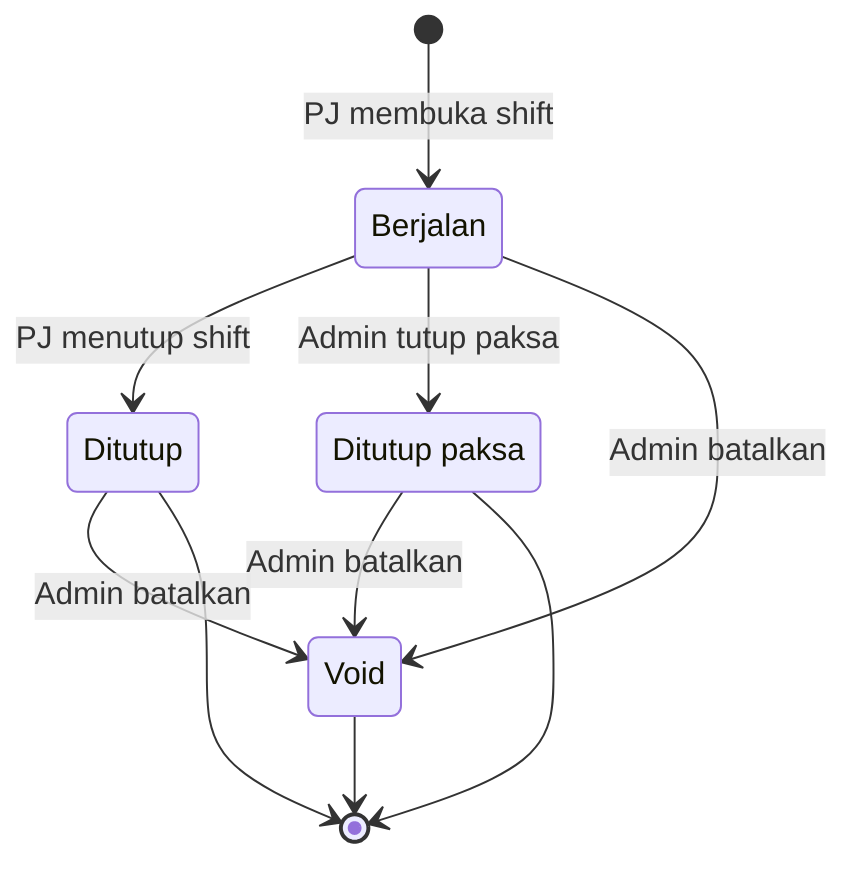
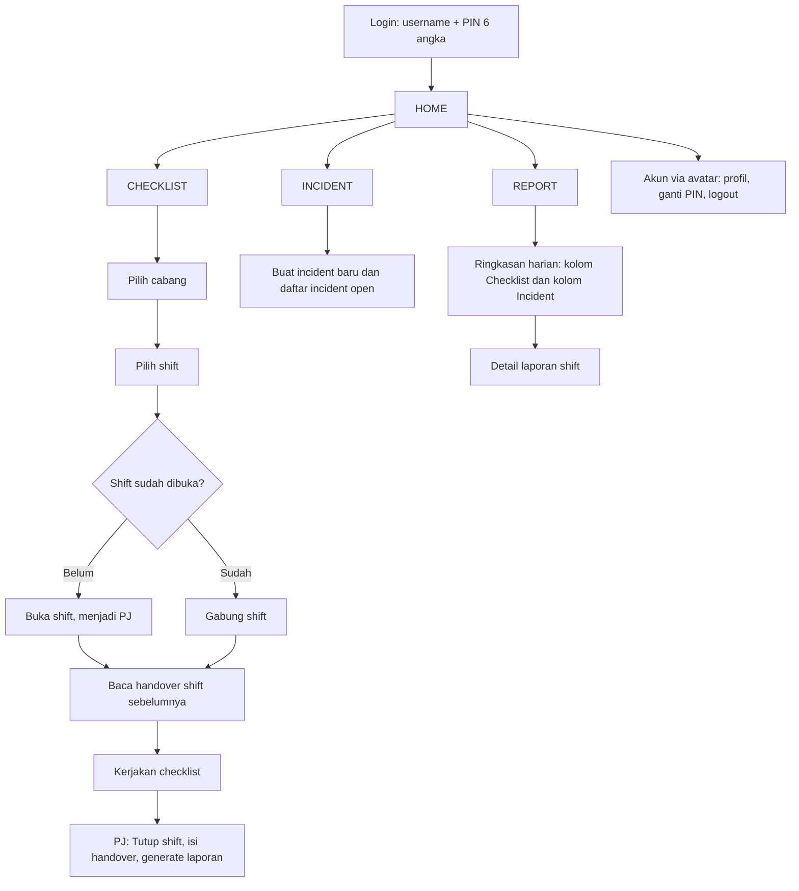
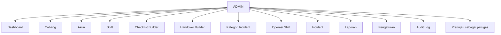

# PRD MyCheck

**Versi:** 1.0 (full fitur, tanpa fase MVP)
**Status:** Draf untuk implementasi
**Bahasa antarmuka:** Indonesia
**Platform:** Progressive Web App (PWA), mobile-first, di-deploy sebagai web app

---

## 1. Ringkasan

**MyCheck** adalah aplikasi untuk memastikan prosedur operasional tiap shift di outlet F&amp;B dijalankan dan terdokumentasi. Petugas mengerjakan checklist bersama-sama, melaporkan kejadian (incident), menulis serah terima (handover) ke shift berikutnya, lalu menutup shift sehingga laporan shift terbentuk otomatis dan terkunci. Admin mengatur seluruh konfigurasi (cabang, akun, shift, checklist, handover, kategori) dan menangani situasi luar biasa.

Aplikasi ini **tidak** memiliki fitur penjadwalan petugas. Siapa yang bekerja pada suatu shift ditentukan dari siapa yang benar-benar bergabung dan beraksi.

### 1.1 Masalah yang diselesaikan

- SOP harian tidak terdokumentasi, sehingga sulit dibuktikan sudah dikerjakan.
- Informasi antar shift hilang karena hanya disampaikan lisan atau lewat chat.
- Kejadian tak biasa (void transaction, bahan basi, kerusakan) tidak tercatat rapi.
- Pemilik/manajemen tidak punya ringkasan harian per cabang yang bisa dilihat cepat.

### 1.2 Tujuan

1. Setiap shift punya satu laporan yang berisi checklist, incident, handover, dan daftar petugas.
2. Pekerjaan bersama tetap terlacak: setiap aksi tercatat siapa dan kapan.
3. Pengisian cepat dan tahan koneksi buruk, karena dipakai sambil bekerja.
4. Admin memegang kendali penuh atas konfigurasi tanpa harus mengubah kode.
5. Perubahan tidak sah terdeteksi, bukan dicegah (integritas data berbasis deteksi + rekonsiliasi).

### 1.3 Bukan tujuan (di luar lingkup)

- Penjadwalan petugas, tukar shift, izin/cuti.
- Absensi clock-in/clock-out dan penggajian.
- Manajemen stok/inventori dan integrasi POS.
- Aplikasi native (hanya PWA).
- Multi-bahasa (hanya Indonesia).

---

## 2. Pengguna dan Peran

Hanya ada dua peran. Tidak ada peran perantara (mis. kepala cabang).

| Peran       | Deskripsi                                                                      | Cakupan                                                  |
| ----------- | ------------------------------------------------------------------------------ | -------------------------------------------------------- |
| **Petugas** | Karyawan outlet yang mengerjakan checklist, melapor incident, menulis handover | Hanya cabang yang diizinkan di akunnya (satu atau lebih) |
| **Admin**   | Pengelola sistem, berkuasa penuh atas konfigurasi dan operasi                  | Semua cabang; satu level (semua admin setara)            |

**Penanggung Jawab (PJ)** bukan peran akun, melainkan **status per shift**: petugas mana pun yang membuka sebuah shift menjadi PJ shift itu.

---

## 3. Glosarium

| Istilah              | Arti                                                                                  |
| -------------------- | ------------------------------------------------------------------------------------- |
| **Cabang**           | Satu lokasi outlet                                                                    |
| **Definisi Shift**   | Template shift per cabang (mis. Opening 07.00-15.00)                                  |
| **Shift** (instance) | Pelaksanaan satu definisi shift pada satu tanggal di satu cabang                      |
| **PJ**               | Penanggung jawab shift; yang membuka dan menutup shift                                |
| **Kategori SOP**     | Pengelompokan Checklist Point (mis. Kebersihan, Food Safety, Kas)                     |
| **Checklist Point**  | Satu butir tugas yang bisa dikerjakan                                                 |
| **Handover**         | Catatan serah terima untuk shift berikutnya                                           |
| **Incident**         | Laporan kejadian di luar normal                                                       |
| **Laporan Shift**    | Hasil akhir shift: checklist + incident + handover + petugas; terkunci setelah dibuat |
| **Addendum**         | Catatan koreksi yang menempel pada laporan terkunci tanpa mengubah isi asli           |
| **Snapshot**         | Salinan template checklist/handover yang dipakai sebuah shift saat dibuka             |

---

## 4. Aturan Bisnis Inti

### 4.1 Siklus hidup shift

| Status            | Arti                                                                                    | Dapat diedit?                            |
| ----------------- | --------------------------------------------------------------------------------------- | ---------------------------------------- |
| **Berjalan**      | Shift dibuka PJ, checklist dan incident aktif                                           | Ya                                       |
| **Ditutup**       | PJ menutup normal, laporan terbentuk                                                    | Tidak (terkunci); koreksi lewat addendum |
| **Ditutup paksa** | Admin menutup karena PJ berhalangan                                                     | Tidak (terkunci); ditandai               |
| **Void**          | Dibatalkan admin (salah buka/uji coba); data tersimpan tapi tidak dihitung di statistik | Tidak                                    |

### 4.2 Aturan shift

- **BR-01** Satu kombinasi *cabang + definisi shift + tanggal shift* hanya boleh punya **satu** shift non-void pada satu waktu.
- **BR-02** **Tanggal shift** mengikuti tanggal saat shift **dibuka** (menurut zona waktu cabang). Shift yang melewati tengah malam tetap masuk tanggal pembukaan.
- **BR-03** Siapa pun yang punya akses ke cabang boleh menjadi PJ dengan membuka shift (termasuk trainee).
- **BR-04** PJ boleh membuka shift di luar jam definisi shift. Laporan menandai "dibuka di luar jam shift". Sistem menampilkan peringatan lunak (tidak memblokir) saat jam sekarang tidak cocok dengan shift yang dipilih.
- **BR-05** Shift memakai **snapshot** checklist dan handover saat dibuka. Perubahan template oleh admin hanya berlaku untuk shift yang dibuka setelahnya.
- **BR-06** Hanya PJ yang dapat menekan **Tutup Shift**. Jika PJ berhalangan, tindakan ada di tangan admin (tutup paksa atau ganti PJ).
- **BR-07** Petugas tercatat sebagai peserta shift saat melakukan **aksi pertama** (mencentang, mengisi, membuat incident, atau menekan "Saya bertugas"). Hanya melihat checklist tidak dihitung.

### 4.3 Aturan checklist bersama

- **BR-10** Satu checklist per shift, dipakai bersama oleh semua peserta.
- **BR-11** Siapa pun yang tergabung boleh menyelesaikan item mana pun, termasuk "pekerjaan" rekan (saling membantu, training). Nama yang tercatat adalah **yang menekan/mengisi**.
- **BR-12** Jika dua orang mengerjakan item yang sama bersamaan, **yang pertama diterima**; yang kedua melihat "sudah diselesaikan oleh X" dan tampilan diperbarui tanpa error.
- **BR-13** Siapa pun yang tergabung boleh membatalkan item selama shift **Berjalan**. Pembatalan tercatat (siapa, kapan) dan jejaknya terlihat.
- **BR-14** Tidak ada fitur "centang semua".
- **BR-15** Item yang mustahil dikerjakan boleh di-**skip dengan alasan wajib**. Skip dianggap terselesaikan untuk keperluan penutupan shift dan ditandai di laporan.
- **BR-16** Setiap item menyimpan: pengisi, waktu aksi, nilai (centang/foto/teks/angka/pilihan), dan label ketepatan waktu bila punya waktu target.

### 4.4 Aturan waktu item

- **BR-20** Waktu target memakai **jam dinding** zona waktu cabang, tidak bergantung kapan petugas memulai.
- **BR-21** Item berwaktu **tidak dikunci**: boleh diisi lebih awal atau terlambat, tetapi diberi label.
- **BR-22** Label: **Tepat waktu** (dalam toleransi), **Lebih awal**, **Terlambat**. Toleransi default **±15 menit**, dapat diubah admin per item.
- **BR-23** Semua penentuan waktu memakai **jam server** (terkoreksi), bukan jam HP, agar tidak bisa dimanipulasi. Untuk aksi offline, waktu aksi dicatat di perangkat lalu dikoreksi dengan selisih terhadap jam server yang dikalibrasi saat online.

### 4.5 Aturan penutupan shift

- **BR-30** Syarat **Tutup Shift** oleh PJ: semua item **wajib** berstatus selesai atau di-skip dengan alasan, dan **handover** terisi (field wajib terpenuhi).
- **BR-31** Alur penutupan: validasi → isi handover → konfirmasi ulang PIN → laporan dibuat dan terkunci.
- **BR-32** Setelah ditutup, checklist, handover, dan daftar petugas shift itu tidak dapat diubah.
- **BR-33** Incident boleh nol, tetapi PJ menegaskan "tidak ada incident" bila memang tidak ada, agar jelas bedanya dengan lupa melapor.
- **BR-34** Pada **tutup paksa** oleh admin, syarat BR-30 tidak diberlakukan; laporan ditandai "ditutup paksa", item wajib yang belum selesai ditandai tidak lengkap, dan alasan wajib dicatat.

### 4.6 Aturan data

- **BR-40** Tidak ada hapus permanen. Data yang tidak lagi dipakai dinonaktifkan/diarsipkan/di-void.
- **BR-41** Incident tidak dapat diedit setelah dikirim; koreksi lewat catatan tambahan.
- **BR-42** Akses data selalu dibatasi di sisi server berdasarkan daftar cabang pada akun.
- **BR-43** Audit log bersifat append-only dan tidak dapat diubah atau dihapus oleh siapa pun.

### 4.7 Edit manual &amp; rekonsiliasi

- **BR-44** Database sepenuhnya dikontrol oleh API; tidak ada edit manual di luar aplikasi.
- **BR-45** API memvalidasi semua input dengan Zod; data tidak valid ditolak dengan pesan jelas.
- **BR-46** Integritas data dijaga oleh constraint database (BR-01) dan hash chain audit log (BR-43). Kerusakan hash chain terdeteksi oleh cron mingguan dan dilaporkan ke admin.

---

## 5. Arsitektur Informasi

### 5.1 Navigasi petugas

Bottom navigation bar: **HOME | CHECKLIST | INCIDENT | REPORT**. Akun diakses lewat avatar di header Home.

### 5.2 Navigasi admin

Admin memakai menu admin tersendiri (sidebar di layar lebar, menu geser di HP) dan dapat beralih ke **mode pratinjau petugas**.

---

## 6. Spesifikasi Fitur Petugas

### 6.1 Autentikasi dan Sesi (AUTH)

| ID      | Persyaratan                                                                                                                                                          |
| ------- | -------------------------------------------------------------------------------------------------------------------------------------------------------------------- |
| AUTH-01 | Login memakai **username + PIN 6 angka**.                                                                                                                            |
| AUTH-02 | PIN disimpan sebagai hash kuat (scrypt/argon2), tidak pernah sebagai teks biasa.                                                                                     |
| AUTH-03 | Percobaan PIN salah dibatasi (default 5 kali), lalu akun terkunci sementara. Admin dapat membuka kunci dan mereset PIN. Batas dan durasi dapat diatur di Pengaturan. |
| AUTH-04 | Sesi bertahan lama (default 30 hari, dapat diatur) karena memakai HP pribadi.                                                                                        |
| AUTH-05 | Aksi sensitif meminta konfirmasi ulang PIN: tutup shift (petugas) dan seluruh aksi sensitif admin (lihat 7.12).                                                      |
| AUTH-06 | Akun nonaktif tidak dapat login; sesi aktifnya dicabut.                                                                                                              |

### 6.2 HOME

Halaman pembuka yang sadar konteks.

| ID      | Persyaratan                                                                                                                                                                            |
| ------- | -------------------------------------------------------------------------------------------------------------------------------------------------------------------------------------- |
| HOME-01 | Header: nama petugas, cabang aktif (pemilih cabang bila akses lebih dari satu), tanggal dan jam saat ini (jam server), avatar menuju Akun.                                             |
| HOME-02 | **Kartu shift aktif** di cabang terpilih: nama shift, PJ, progress checklist (mis. 12/20), tombol sesuai konteks: *Buka Shift*, *Gabung*, *Lanjutkan*, atau *Tutup Shift* (khusus PJ). |
| HOME-03 | **Tugas berikutnya** yang waktu targetnya terdekat.                                                                                                                                    |
| HOME-04 | **Banner handover** dari shift sebelumnya bila belum ditandai "sudah dibaca".                                                                                                          |
| HOME-05 | Daftar singkat **incident open** di cabang terpilih.                                                                                                                                   |
| HOME-06 | **Grid shortcut** ke aksi umum: Buat Incident, Checklist, Laporan Hari Ini, Handover Terakhir. Grid tidak menduplikasi bar navigasi, melainkan mengarah ke aksi spesifik.              |
| HOME-07 | Indikator status koneksi (lihat 9.3).                                                                                                                                                  |
| HOME-08 | Pusat notifikasi dalam aplikasi (lihat 8).                                                                                                                                             |

### 6.3 CHECKLIST

#### Alur

1. Masuk tab **Checklist**.
2. **Modal pilih cabang** (dilewati bila hanya satu akses; mengingat pilihan terakhir).
3. **Pilih shift** dari definisi cabang tersebut. Bila jam sekarang tidak cocok, tampil peringatan lunak.
4. Jika shift belum dibuka: tombol **Buka Shift** (pengguna menjadi PJ). Jika sudah dibuka: **Gabung**.
5. **Baca handover** shift sebelumnya, lalu tekan *Sudah dibaca*. Jika belum ada handover sebelumnya, langkah dilewati.
6. Daftar checklist muncul langsung, dikelompokkan per **Kategori SOP**.
7. Kerjakan item; progress bersama terlihat semua peserta.
8. PJ: **Tutup Shift** → validasi → handover → konfirmasi PIN → laporan terbentuk dan terkunci.
9. Opsional: bagikan laporan ke WhatsApp.

#### Persyaratan

| ID    | Persyaratan                                                                                                                                              |
| ----- | -------------------------------------------------------------------------------------------------------------------------------------------------------- |
| CK-01 | Shift yang sedang berjalan dibuka kembali langsung (resume) tanpa melewati modal pilihan.                                                                |
| CK-02 | **Auto-save** per item; tidak ada tombol simpan global.                                                                                                  |
| CK-03 | Tipe input item: **centang**, **foto**, **teks**, **angka** (dengan rentang normal opsional; di luar rentang ditandai), dan **OK / Tidak OK**.           |
| CK-04 | Setiap item yang selesai menampilkan inisial/nama pengisi dan jam.                                                                                       |
| CK-05 | Item berwaktu menampilkan waktu target dan label **Tepat waktu / Lebih awal / Terlambat** sesuai 4.4.                                                    |
| CK-06 | Item **wajib** diberi penanda; item opsional tidak menahan penutupan.                                                                                    |
| CK-07 | **Skip dengan alasan wajib** untuk item yang tidak dapat dikerjakan; setelah skip, ditawarkan pembuatan incident dengan data terisi otomatis (opsional). |
| CK-08 | Pembatalan centang oleh peserta mana pun selama Berjalan; tercatat pada riwayat item.                                                                    |
| CK-09 | Foto dikompres di sisi klien sebelum unggah; unggah berjalan di latar belakang dengan indikator per foto.                                                |
| CK-10 | Progress bersama diperbarui berkala (15-30 detik) dan saat aplikasi dibuka kembali; tidak mensyaratkan realtime penuh.                                   |
| CK-11 | Benturan dua pengisi mengikuti BR-12.                                                                                                                    |
| CK-12 | Tombol "Saya bertugas" untuk bergabung eksplisit tanpa harus mengisi item.                                                                               |
| CK-13 | Daftar peserta shift terlihat (nama, jumlah item yang dicatat). Ditampilkan sebagai informasi, bukan peringkat.                                          |
| CK-14 | Item hanya muncul pada **hari berlaku** yang ditetapkan admin (bila ada).                                                                                |
| CK-15 | Handover diisi di alur penutupan (lihat 6.3.1).                                                                                                          |

#### 6.3.1 Handover

- Terdiri dari **field terstruktur** (dikonfigurasi admin per shift; ada yang wajib dan ada yang opsional) ditambah **kotak teks bebas** dan **tambah foto** (opsional).
- Incident yang masih open di cabang tampil otomatis sebagai informasi di handover.
- Handover bersifat satu per shift; tercatat siapa pengirimnya.
- Setelah laporan dibuat, handover terkunci.
- Shift berikutnya di cabang yang sama melihatnya sebagai banner/halaman baca dan menandai **Sudah dibaca** (tercatat siapa dan kapan).
- "Shift sebelumnya" didefinisikan sebagai shift terakhir yang berstatus Ditutup/Ditutup paksa di cabang yang sama.

### 6.4 INCIDENT

| ID    | Persyaratan                                                                                                                                                                                                                                                                                       |
| ----- | ------------------------------------------------------------------------------------------------------------------------------------------------------------------------------------------------------------------------------------------------------------------------------------------------- |
| IN-01 | Alur buat: pilih **kategori** → isi **deskripsi** → **foto** (opsional, hingga 5) → kirim. Target waktu isi kurang dari 1 menit.                                                                                                                                                                  |
| IN-02 | Field otomatis: cabang, pelapor, shift terkait, waktu kirim. **Waktu kejadian** default sekarang dan dapat diubah.                                                                                                                                                                                |
| IN-03 | Penautan shift otomatis: incident ditautkan ke shift yang **sedang berjalan**, atau shift yang **baru berakhir dalam jendela waktu tertentu** (default 4 jam, dapat diatur). Jika tidak ada, status **Di luar shift** dan berdiri sendiri. Admin dapat menautkannya ke shift yang tepat kemudian. |
| IN-04 | Status: **Open** dan **Selesai**. Status diubah oleh admin. Petugas dapat menambah **catatan lanjutan**.                                                                                                                                                                                          |
| IN-05 | Setelah dikirim, isi incident **tidak dapat diedit**. Koreksi lewat catatan tambahan (IN-06).                                                                                                                                                                                                     |
| IN-06 | Catatan tambahan pada incident tercatat dengan penulis dan waktu.                                                                                                                                                                                                                                 |
| IN-07 | Tab Incident menampilkan tombol buat baru dan **daftar incident open** di cabang terpilih; detail dapat dibuka.                                                                                                                                                                                   |
| IN-08 | Incident dapat dibuat dari item checklist yang gagal atau di-skip dengan data terisi awal.                                                                                                                                                                                                        |
| IN-09 | Kategori incident dikelola admin (mis. void transaction, menu basi, kecelakaan kerja, kerusakan peralatan, komplain, keamanan, lainnya).                                                                                                                                                          |
| IN-10 | Saat offline, incident tidak dapat dibuat (wajib online). Lihat 9.3.                                                                                                                                                                                                                              |

### 6.5 REPORT

Tujuan: sekali lihat, orang tahu *"hari ini checklist-nya begini, dan incident-nya ini"*.

| ID    | Persyaratan                                                                                                                                                                                                                                                      |
| ----- | ---------------------------------------------------------------------------------------------------------------------------------------------------------------------------------------------------------------------------------------------------------------- |
| RP-01 | Unit tampilan utama adalah **per tanggal** (default hari ini) dengan navigasi hari sebelumnya/berikutnya dan pemilih cabang (sesuai akses).                                                                                                                      |
| RP-02 | **Dua kolom**: *Laporan Checklist* dan *Laporan Incident*. Di layar lebar ditampilkan berdampingan; di HP ditampilkan sebagai dua kartu ringkasan di atas dengan toggle ke daftar masing-masing.                                                                 |
| RP-03 | Kolom Checklist: satu kartu per shift pada tanggal itu: nama shift, status (berjalan/ditutup/ditutup paksa), progress, PJ, peserta, penanda (di luar jam, ada item di-skip, tidak lengkap).                                                                      |
| RP-04 | Kolom Incident: semua incident tanggal itu dari semua shift (termasuk di luar shift): kategori, jam, pelapor, status.                                                                                                                                            |
| RP-05 | **Detail laporan shift**: header (cabang, tanggal, shift, PJ, peserta), checklist per Kategori SOP dengan label ketepatan waktu, foto bukti, item di-skip beserta alasan, incident shift itu, handover, ringkasan kontribusi per petugas, dan addendum bila ada. |
| RP-06 | Tombol **Bagikan ke WhatsApp** (tautan `wa.me` dengan pesan ringkasan dan tautan laporan). Isi pesan memakai template dari admin (lihat 7.11).                                                                                                                   |
| RP-07 | Laporan bersifat **read-only**.                                                                                                                                                                                                                                  |
| RP-08 | Petugas hanya melihat laporan cabang yang ada di aksesnya.                                                                                                                                                                                                       |
| RP-09 | Filter tambahan: shift, rentang tanggal (riwayat).                                                                                                                                                                                                               |
| RP-10 | Laporan shift yang masih berjalan tampil sebagai "berjalan" dengan progress terkini.                                                                                                                                                                             |

**Pemisahan peran tab:** tab *Incident* adalah daftar kerja (buat baru dan yang masih open); tab *Report* adalah arsip dan ringkasan harian.

### 6.6 Akun

| ID     | Persyaratan                                                            |
| ------ | ---------------------------------------------------------------------- |
| ACC-01 | Lihat profil: nama, username, peran, daftar cabang yang dapat diakses. |
| ACC-02 | Ganti PIN (mensyaratkan PIN lama).                                     |
| ACC-03 | Logout; opsi keluar dari semua perangkat.                              |
| ACC-04 | Pemilih cabang aktif untuk akun dengan akses lebih dari satu cabang.   |

---

## 7. Spesifikasi Fitur Admin

Admin memiliki akses penuh ke semua cabang dan modul berikut. Admin juga dapat memakai seluruh fitur petugas.

### 7.1 Dashboard

| ID        | Persyaratan                                                                                                                                                                    |
| --------- | ------------------------------------------------------------------------------------------------------------------------------------------------------------------------------ |
| ADM-DB-01 | Ringkasan hari ini per cabang: shift berjalan, PJ, progress checklist, incident open, laporan yang digenerate hari ini.                                                        |
| ADM-DB-02 | **Peringatan**: shift melewati jam selesai tanpa ditutup; shift yang seharusnya sudah dibuka tetapi belum; item wajib berwaktu yang terlambat; incident open yang paling lama. |
| ADM-DB-03 | Filter cabang dan tanggal; ketuk kartu untuk masuk ke detail terkait.                                                                                                          |

### 7.2 Cabang

| ID        | Persyaratan                                                                                                              |
| --------- | ------------------------------------------------------------------------------------------------------------------------ |
| ADM-BR-01 | Buat, ubah, nonaktifkan (arsip) cabang: nama, kode, alamat singkat, **zona waktu** (default Asia/Jakarta).               |
| ADM-BR-02 | **Salin dari cabang lain**: menduplikasi definisi shift, checklist, dan handover sebagai salinan mandiri (bukan tautan). |
| ADM-BR-03 | Cabang nonaktif tidak dapat dibuka shift barunya; riwayatnya tetap dapat dilihat.                                        |

### 7.3 Akun

| ID        | Persyaratan                                                                                               |
| --------- | --------------------------------------------------------------------------------------------------------- |
| ADM-AC-01 | Buat akun: nama, username (unik), PIN awal, peran (Petugas/Admin), daftar akses cabang (satu atau lebih). |
| ADM-AC-02 | Ubah nama, peran, dan akses cabang kapan saja.                                                            |
| ADM-AC-03 | **Reset PIN**, **buka kunci** akun, **paksa logout** semua sesi.                                          |
| ADM-AC-04 | Nonaktifkan/aktifkan akun (bukan hapus), sehingga nama pada laporan lama tetap utuh.                      |
| ADM-AC-05 | Lihat login terakhir dan ringkasan aktivitas.                                                             |
| ADM-AC-06 | Admin terakhir yang aktif **tidak dapat** dinonaktifkan atau diturunkan perannya.                         |

### 7.4 Definisi Shift (per cabang)

| ID        | Persyaratan                                                                                                   |
| --------- | ------------------------------------------------------------------------------------------------------------- |
| ADM-SH-01 | Kelola shift per cabang: nama, jam mulai, jam selesai, urutan, aktif/nonaktif, penanda melewati tengah malam. |
| ADM-SH-02 | Jumlah shift per hari bebas; shift boleh tumpang tindih.                                                      |
| ADM-SH-03 | Salin definisi dari cabang lain lalu sesuaikan.                                                               |

### 7.5 Checklist Builder

Hierarki: **Cabang → Shift → Kategori SOP → Checklist Point**.

| Properti Checklist Point | Keterangan                                                          |
| ------------------------ | ------------------------------------------------------------------- |
| Judul dan instruksi      | Teks utama, penjelasan opsional                                     |
| Tipe input               | Centang, foto, teks, angka (rentang normal opsional), OK / Tidak OK |
| Wajib / opsional         | Hanya yang wajib menahan penutupan shift                            |
| Waktu target             | Opsional, jam dinding                                               |
| Toleransi                | Default ±15 menit, dapat diubah per item                            |
| Hari berlaku             | Opsional (mis. hanya Senin)                                         |
| Urutan                   | Atur dengan seret-lepas                                             |
| Aktif                    | Nonaktifkan, bukan hapus                                            |

| ID        | Persyaratan                                                                        |
| --------- | ---------------------------------------------------------------------------------- |
| ADM-CK-01 | CRUD Kategori SOP (bentuk bebas, ditentukan admin) dan Checklist Point per shift.  |
| ADM-CK-02 | Duplikasi item, kategori, atau seluruh shift; salin antar cabang.                  |
| ADM-CK-03 | **Pratinjau sebagai petugas** sebelum menyimpan.                                   |
| ADM-CK-04 | Perubahan berlaku untuk shift berikutnya; shift berjalan memakai snapshot (BR-05). |
| ADM-CK-05 | Penonaktifan item tidak menghapus riwayat pengisiannya di laporan lama.            |
| ADM-CK-06 | Riwayat versi template (siapa mengubah apa dan kapan) tersedia lewat audit log.    |

### 7.6 Handover Builder

| ID        | Persyaratan                                                                                                          |
| --------- | -------------------------------------------------------------------------------------------------------------------- |
| ADM-HO-01 | Kelola field handover per shift: label, tipe (teks pendek, angka, pilihan, ya/tidak), wajib/opsional, urutan, aktif. |
| ADM-HO-02 | Kotak teks bebas dan tambah foto selalu tersedia (opsional) di bagian bawah form.                                    |
| ADM-HO-03 | Salin antar shift dan antar cabang.                                                                                  |

### 7.7 Kategori Incident

| ID        | Persyaratan                                                                                                                            |
| --------- | -------------------------------------------------------------------------------------------------------------------------------------- |
| ADM-IC-01 | Tambah, ubah, nonaktifkan kategori. Kategori berlaku global; dukungan kategori per cabang dapat ditambahkan tanpa mengubah model data. |

### 7.8 Operasi Shift

| ID        | Persyaratan                                                                                                                                           |
| --------- | ----------------------------------------------------------------------------------------------------------------------------------------------------- |
| ADM-OP-01 | Lihat semua shift berjalan lintas cabang.                                                                                                             |
| ADM-OP-02 | **Tutup paksa**: menutup shift yang tidak ditutup PJ. Alasan wajib; laporan ditandai "ditutup paksa" (BR-34).                                         |
| ADM-OP-03 | **Ganti PJ**: memindahkan tanggung jawab ke petugas lain yang punya akses cabang; alasan wajib; tercatat dari siapa ke siapa.                         |
| ADM-OP-04 | **Buka shift atas nama** petugas tertentu bila PJ lupa membuka.                                                                                       |
| ADM-OP-05 | **Void**: membatalkan shift yang dibuka tidak sengaja atau uji coba; alasan wajib; data tetap tersimpan tetapi tidak dihitung di statistik.           |
| ADM-OP-06 | **Koreksi laporan terkunci** lewat **addendum** sebagai jalur utama (isi asli tetap utuh, addendum tampil di bawah laporan dengan penulis dan waktu). |
| ADM-OP-07 | **Buka kunci laporan** hanya sebagai jalur darurat, alasan wajib, konfirmasi PIN, dan tercatat jelas di audit log serta pada laporan.                 |

### 7.9 Incident (sisi admin)

| ID        | Persyaratan                                                                          |
| --------- | ------------------------------------------------------------------------------------ |
| ADM-IN-01 | Daftar semua incident lintas cabang dengan filter kategori, status, cabang, tanggal. |
| ADM-IN-02 | Ubah status Open/Selesai dan tambah catatan admin.                                   |
| ADM-IN-03 | Tautkan incident "di luar shift" ke shift yang tepat, atau biarkan berdiri sendiri.  |
| ADM-IN-04 | Isi asli incident tidak dapat diubah (BR-41).                                        |

### 7.10 Laporan dan Statistik

| ID        | Persyaratan                                                                                                                                                                                                                                                         |
| --------- | ------------------------------------------------------------------------------------------------------------------------------------------------------------------------------------------------------------------------------------------------------------------- |
| ADM-RP-01 | Daftar laporan semua cabang dengan filter cabang, tanggal, shift, PJ, status (ditutup/ditutup paksa/void).                                                                                                                                                          |
| ADM-RP-02 | Detail laporan identik dengan RP-05, ditambah tindakan admin (addendum, buka kunci, void).                                                                                                                                                                          |
| ADM-RP-03 | Bagikan via WhatsApp dan **halaman publik bertoken**; admin dapat mencabut (revoke) token.                                                                                                                                                                          |
| ADM-RP-04 | **Statistik dasar**: kepatuhan checklist per cabang dan shift, persentase tepat waktu / lebih awal / terlambat, item sering di-skip, incident per kategori dan waktu penyelesaian, shift tanpa laporan, kontribusi per petugas (informasi netral, bukan peringkat). |
| ADM-RP-05 | **Ekspor** laporan ke PDF dan data ke CSV.                                                                                                                                                                                                                          |
| ADM-RP-06 | Deteksi **shift tanpa laporan**: definisi shift aktif cabang yang tidak memiliki shift pada hari berjalan setelah jam selesainya.                                                                                                                                   |

### 7.11 Pengaturan Sistem

| Pengaturan                               | Default                                                                             |
| ---------------------------------------- | ----------------------------------------------------------------------------------- |
| Toleransi waktu item                     | ±15 menit                                                                           |
| Batas percobaan PIN salah / durasi kunci | 5 kali / 15 menit                                                                   |
| Durasi sesi login                        | 30 hari                                                                             |
| Masa berlaku tautan laporan publik       | 30 hari (dapat diatur)                                                              |
| **Template pesan WhatsApp**              | Dapat diatur admin (dengan variabel: cabang, tanggal, shift, PJ, ringkasan, tautan) |
| Jendela penautan otomatis incident       | 4 jam                                                                               |
| Batas jumlah dan ukuran foto             | 5 foto per incident; ukuran maksimum per foto dapat diatur                          |
| Retensi foto                             | Dapat diatur                                                                        |
| Tampilkan foto pada halaman publik       | Dapat diatur                                                                        |

### 7.12 Aturan Pengaman Admin

- **ADM-SEC-01** Aksi sensitif wajib **alasan** dan **konfirmasi ulang PIN**: tutup paksa, ganti PJ, void, buka kunci laporan, reset PIN, ubah peran/akses, nonaktifkan akun.
- **ADM-SEC-02** Tidak ada hapus permanen (BR-40).
- **ADM-SEC-03** Admin terakhir dilindungi (ADM-AC-06).
- **ADM-SEC-04** Semua tindakan admin masuk audit log yang dapat dilihat oleh admin lain.
- **ADM-SEC-05** **Mode pratinjau petugas** untuk menguji tanpa menulis data palsu ke laporan nyata (data uji ditandai dan dikecualikan dari statistik).

### 7.13 Audit Log

| ID        | Persyaratan                                                                                                                                                                                                      |
| --------- | ---------------------------------------------------------------------------------------------------------------------------------------------------------------------------------------------------------------- |
| ADM-AL-01 | Mencatat: siapa, apa, kapan, objek, nilai sebelum/sesudah, alasan (bila ada).                                                                                                                                    |
| ADM-AL-02 | Cakupan minimal: perubahan template (checklist/handover/shift/kategori), akun dan akses, tutup paksa, ganti PJ, void, addendum, buka kunci, reset PIN, perubahan pengaturan, pembuatan/pencabutan tautan publik. |
| ADM-AL-03 | Dapat difilter berdasarkan pelaku, jenis aksi, objek, dan rentang tanggal. Hanya bisa dibaca (BR-43).                                                                                                            |

---

## 8. Notifikasi

| ID    | Persyaratan                                                                                                                                                                                                 |
| ----- | ----------------------------------------------------------------------------------------------------------------------------------------------------------------------------------------------------------- |
| NT-01 | **Pusat notifikasi dalam aplikasi** (daftar, penanda sudah dibaca) sebagai kanal utama yang dijamin tersedia.                                                                                               |
| NT-02 | **Web push** sebagai kanal tambahan bila perangkat dan browser mendukung. Pada iOS, push PWA hanya tersedia setelah aplikasi dipasang ke layar utama; perilaku ini harus dijelaskan pada proses pemasangan. |
| NT-03 | Untuk petugas: handover baru dari shift sebelumnya, pengingat item berwaktu yang akan jatuh tempo, penggantian PJ, shift ditutup paksa.                                                                     |
| NT-04 | Untuk admin: shift tidak ditutup melewati jam selesai, shift tidak dibuka, incident baru (khususnya yang dikategorikan penting), shift ditutup, aksi darurat.                                               |
| NT-05 | Preferensi notifikasi dapat dimatikan per jenis oleh pengguna.                                                                                                                                              |

---

## 9. Persyaratan Non-Fungsional

### 9.1 PWA

- Web app manifest, ikon, mode standalone, dan ajakan **Pasang ke layar utama**.
- Service worker: *app shell* di-cache; data baca memakai strategi stale-while-revalidate.
- Tampilan responsif; prioritas layar HP dengan tombol besar dan alur satu tangan.

### 9.2 Performa

- Halaman pertama interaktif dalam waktu wajar pada jaringan seluler 4G biasa.
- Pencentangan item terasa instan (optimistic update), sinkronisasi di latar belakang.
- Foto dikompres di klien dan diunggah bertahap.

### 9.3 Offline dan sinkronisasi

- Tersedia offline (read-only dari cache): melihat checklist shift yang di-cache, melihat report yang di-cache.
- **Wajib online**: login awal, membuka shift, menutup shift/generate laporan, tindakan admin, pengisian item, pembuatan incident, dan pembuatan tautan bagikan.
- Optimistic update untuk centang item: tampil selesai dulu, rollback otomatis jika request gagal dengan pesan jelas.
- Saat offline: banner "Tidak ada koneksi" muncul; tombol aksi yang wajib online ditampilkan disabled dengan pesan "Perlu koneksi internet".

### 9.4 Keamanan dan privasi

- HTTPS wajib; cookie sesi `HttpOnly`, `Secure`, `SameSite`.
- Otorisasi dilakukan di server untuk **setiap** permintaan berdasarkan peran dan daftar cabang; tidak mengandalkan penyembunyian di antarmuka.
- Perlindungan CSRF, validasi input, dan pembatasan laju (rate limiting) pada login dan aksi sensitif.
- Unggahan foto divalidasi (tipe dan ukuran), disimpan terpisah dari basis data, dan diakses lewat tautan yang tidak mudah ditebak.
- Token tautan publik bersifat acak dan panjang, dapat kedaluwarsa dan dicabut.
- Data pribadi minimal (nama, username); tidak menyimpan data sensitif lain.
- Audit log append-only.

### 9.5 Keandalan

- Pencadangan basis data berkala dan dapat dipulihkan.
- Penanganan zona waktu per cabang secara konsisten (penyimpanan waktu dalam UTC, tampilan sesuai zona cabang).

### 9.6 Aksesibilitas dan kegunaan

- Target sentuh besar, kontras memadai, teks dapat dibaca di bawah cahaya dapur/kasir.
- Bahasa Indonesia yang singkat dan lugas.
- Pesan galat yang jelas dan dapat ditindaklanjuti.

---

## 10. Model Data (Konseptual)

Seluruh entitas memiliki `id`, `created_at`, `updated_at`; entitas yang dapat dinonaktifkan memiliki `is_active`.

| Entitas                    | Field utama                                                                                                                                                                                    |
| -------------------------- | ---------------------------------------------------------------------------------------------------------------------------------------------------------------------------------------------- |
| **User**                   | name, username (unik), pin\_hash, role (admin/petugas), is\_active, failed\_attempts, locked\_until, last\_login\_at                                                                           |
| **Branch**                 | name, code, address, timezone, is\_active                                                                                                                                                      |
| **UserBranchAccess**       | user\_id, branch\_id                                                                                                                                                                           |
| **ShiftDefinition**        | branch\_id, name, start\_time, end\_time, crosses\_midnight, sort\_order, is\_active                                                                                                           |
| **SopCategory**            | shift\_definition\_id, name, sort\_order, is\_active                                                                                                                                           |
| **ChecklistPointTemplate** | sop\_category\_id, title, instruction, input\_type, is\_required, target\_time, tolerance\_minutes, active\_days, number\_min, number\_max, sort\_order, is\_active                            |
| **HandoverFieldTemplate**  | shift\_definition\_id, label, field\_type, options, is\_required, sort\_order, is\_active                                                                                                      |
| **IncidentCategory**       | name, is\_active, sort\_order                                                                                                                                                                  |
| **ShiftInstance**          | branch\_id, shift\_definition\_id, shift\_date, status, pj\_user\_id, opened\_at, closed\_at, opened\_outside\_hours, closed\_by, close\_type (normal/paksa), void\_reason, template\_snapshot |
| **ShiftParticipant**       | shift\_instance\_id, user\_id, first\_action\_at                                                                                                                                               |
| **ChecklistEntry**         | shift\_instance\_id, point\_ref (dari snapshot), state (belum/selesai/skip), value, photo\_urls, completed\_by, completed\_at, timing\_label, skip\_reason                                     |
| **ChecklistEntryLog**      | entry\_id, action (selesai/batal/skip), user\_id, at, note                                                                                                                                     |
| **HandoverEntry**          | shift\_instance\_id, values (per field), free\_text, photo\_urls, submitted\_by, submitted\_at                                                                                                 |
| **HandoverAck**            | handover\_id, reading\_shift\_instance\_id / user\_id, read\_at                                                                                                                                |
| **Incident**               | branch\_id, shift\_instance\_id (nullable), category\_id, description, severity (opsional), occurred\_at, reported\_by, reported\_at, status, outside\_shift                                   |
| **IncidentPhoto**          | incident\_id, url                                                                                                                                                                              |
| **IncidentNote**           | incident\_id, author\_id, note, at                                                                                                                                                             |
| **ShiftReport**            | shift\_instance\_id, number, generated\_by, generated\_at, summary\_stats, is\_locked                                                                                                          |
| **ReportAddendum**         | report\_id, author\_id, note, at                                                                                                                                                               |
| **ReportShareToken**       | report\_id, token\_hash, expires\_at, revoked\_at, created\_by                                                                                                                                 |
| **Notification**           | user\_id, type, payload, read\_at, created\_at                                                                                                                                                 |
| **Setting**                | key, value                                                                                                                                                                                     |
| **AuditLog**               | actor\_id, action, object\_type, object\_id, before, after, reason, at                                                                                                                         |
| **Session**                | user\_id, device\_info, created\_at, expires\_at, revoked\_at                                                                                                                                  |

Catatan desain:

- `point_ref` mengacu ke butir pada **snapshot** shift, bukan langsung ke template, agar laporan lama tidak berubah saat template diedit.
- `ShiftInstance` adalah entitas induk yang menjadi tempat checklist, handover, incident, dan laporan menempel.

---

## 11. Kasus Tepi dan Penanganan

| Situasi                                   | Penanganan                                                                           |
| ----------------------------------------- | ------------------------------------------------------------------------------------ |
| PJ lupa menutup shift                     | Peringatan ke admin; admin tutup paksa atau ganti PJ                                 |
| PJ pulang di tengah shift                 | Admin ganti PJ                                                                       |
| Dua orang menekan Buka Shift bersamaan    | Yang pertama menjadi PJ; yang kedua otomatis bergabung                               |
| Shift melewati tengah malam               | Tanggal shift = tanggal dibuka                                                       |
| Item berwaktu diisi jauh dari target      | Boleh, diberi label Lebih awal/Terlambat                                             |
| Template diubah saat shift berjalan       | Tidak berpengaruh pada shift berjalan (snapshot)                                     |
| Item di snapshot tidak lagi relevan       | Peserta dapat skip dengan alasan                                                     |
| Koneksi putus saat mengisi                | Pesan error jelas; centang belum tersimpan; coba lagi saat online                    |
| Aksi offline kalah oleh aksi lain         | Ditampilkan jelas sebagai "sudah diselesaikan oleh X"                                |
| Foto gagal diunggah                       | Pesan error jelas; foto belum tersimpan; coba lagi saat online                       |
| Incident terjadi di luar shift            | Status "Di luar shift"; ditautkan otomatis bila masuk jendela waktu, atau oleh admin |
| Petugas berakses dua cabang               | Pemilih cabang; nama pelaku tetap tercatat                                           |
| Petugas dinonaktifkan di tengah shift     | Sesi dicabut; aksi sebelumnya tetap tercatat dengan namanya                          |
| Cabang dinonaktifkan saat shift berjalan  | Shift diselesaikan/ditutup paksa oleh admin; tidak ada shift baru                    |
| Laporan salah isi setelah terkunci        | Addendum; buka kunci hanya darurat                                                   |
| Shift dibuka salah / uji coba             | Admin void                                                                           |
| Admin terakhir mencoba menonaktifkan diri | Ditolak                                                                              |
| Jam HP tidak sinkron                      | Penentuan waktu memakai jam server terkoreksi                                        |

---

## 12. Metrik Keberhasilan

| Metrik                                                | Target indikatif              |
| ----------------------------------------------------- | ----------------------------- |
| Shift dengan laporan terbentuk                        | Mendekati 100%                |
| Shift yang ditutup normal oleh PJ (bukan tutup paksa) | Tinggi dan stabil             |
| Kepatuhan item wajib (selesai atau skip beralasan)    | Tinggi dan stabil             |
| Persentase item berwaktu tepat waktu                  | Meningkat dari waktu ke waktu |
| Waktu rata-rata membuat incident                      | Kurang dari 1 menit           |
| Waktu rata-rata penyelesaian incident                 | Menurun dari waktu ke waktu   |
| Handover yang dibaca shift berikutnya                 | Mendekati 100%                |
| Kegagalan sinkronisasi yang tidak pulih               | Mendekati 0                   |

Target numerik final ditentukan setelah ada data awal.

---

## 13. Ketergantungan Antar Modul (untuk perencanaan implementasi)

Bukan fase rilis; seluruh fitur dikerjakan sebagai satu produk. Urutan ini hanya menunjukkan ketergantungan teknis:

1. Fondasi: autentikasi, peran, akses cabang, zona waktu, audit log.
2. Konfigurasi: cabang, definisi shift, checklist builder, handover builder, kategori incident.
3. Inti operasional: siklus shift (buka/gabung/tutup), checklist bersama, handover, incident.
4. Pelaporan: pembentukan laporan terkunci, tab Report, bagikan WhatsApp, tautan publik.
5. Operasi admin: tutup paksa, ganti PJ, void, addendum, buka kunci.
6. Lapisan pendukung: offline dan sinkronisasi, notifikasi, statistik, ekspor, dashboard dan peringatan.

---

## 14. Asumsi dan Keputusan Terbuka

Asumsi yang dipakai dalam dokumen ini dan dapat diubah:

| #   | Asumsi                                                                         | Dampak bila berubah                                    |
| --- | ------------------------------------------------------------------------------ | ------------------------------------------------------ |
| 1   | Status incident hanya diubah admin; petugas menambah catatan lanjutan          | Perlu izin tambahan untuk petugas                      |
| 2   | Konfirmasi ulang PIN saat PJ menutup shift                                     | Menambah/menghapus satu langkah di alur penutupan      |
| 3   | Masa berlaku tautan publik default 30 hari                                     | Hanya mengubah nilai default                           |
| 4   | Jendela penautan otomatis incident 4 jam                                       | Hanya mengubah nilai default                           |
| 5   | Kategori incident berlaku global                                               | Per cabang menambah satu kolom relasi                  |
| 6   | Durasi sesi 30 hari                                                            | Hanya mengubah nilai default                           |
| 7   | Keamanan lanjutan (mis. 2FA) tidak diperlukan karena login memakai PIN 6 angka | Perlu desain tambahan                                  |
| 8   | Database sepenuhnya dikontrol oleh API; tidak ada edit manual di luar aplikasi | Integritas dijaga constraint DB + hash chain audit log |

Hal yang sengaja belum ditetapkan di dokumen ini:

- **Teknologi dan basis data** (framework, penyimpanan data, penyimpanan foto, penyedia hosting). Dibahas terpisah setelah PRD disetujui.
- **Desain visual** (warna, tipografi, komponen). Dibahas dalam dokumen desain terpisah.
- **Target numerik final** metrik keberhasilan.

---

## 15. Lampiran Matriks Izin

| Aksi                                                      | Petugas                    | Admin                                  |
| --------------------------------------------------------- | -------------------------- | -------------------------------------- |
| Login, ganti PIN sendiri                                  | Ya                         | Ya                                     |
| Buka shift (jadi PJ)                                      | Ya (cabang berakses)       | Ya                                     |
| Gabung dan mengerjakan checklist                          | Ya                         | Ya                                     |
| Skip item dengan alasan                                   | Ya                         | Ya                                     |
| Membatalkan centang                                       | Ya (selama shift berjalan) | Ya                                     |
| Tutup shift normal                                        | Hanya PJ                   | Hanya bila PJ (atau lewat tutup paksa) |
| Buat incident                                             | Ya                         | Ya                                     |
| Tambah catatan pada incident                              | Ya                         | Ya                                     |
| Ubah status incident                                      | Tidak                      | Ya                                     |
| Lihat laporan                                             | Cabang berakses            | Semua                                  |
| Bagikan laporan ke WhatsApp                               | Ya                         | Ya                                     |
| Kelola cabang, akun, shift, checklist, handover, kategori | Tidak                      | Ya                                     |
| Tutup paksa, ganti PJ, void, buka shift atas nama         | Tidak                      | Ya                                     |
| Addendum dan buka kunci laporan                           | Tidak                      | Ya                                     |
| Pengaturan sistem                                         | Tidak                      | Ya                                     |
| Lihat audit log                                           | Tidak                      | Ya                                     |
| Statistik dan ekspor                                      | Tidak                      | Ya                                     |

